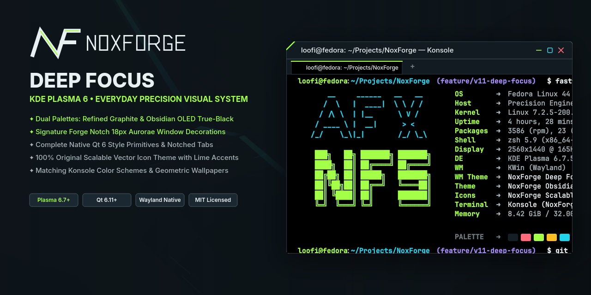
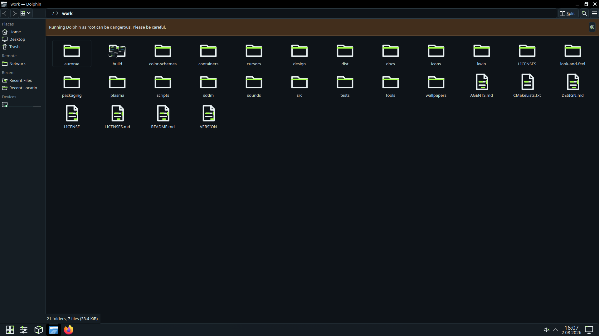
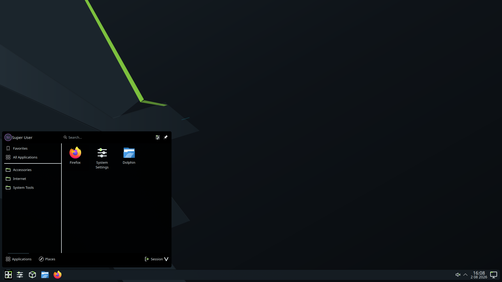
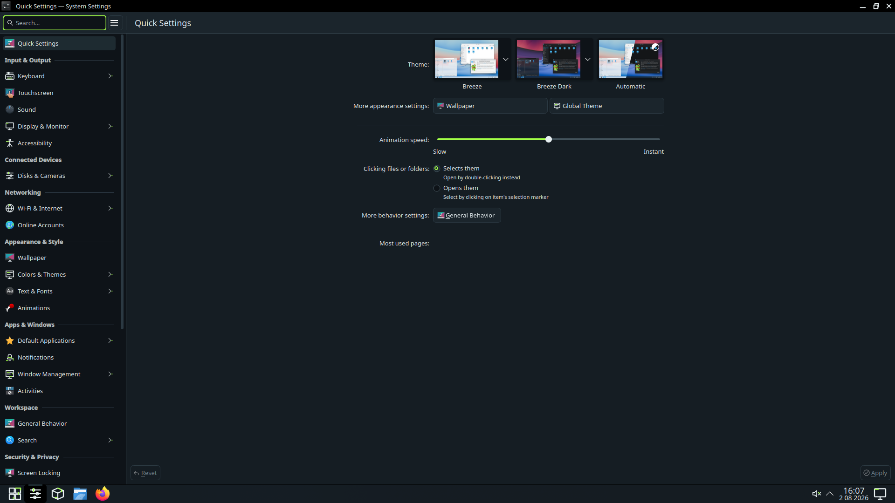
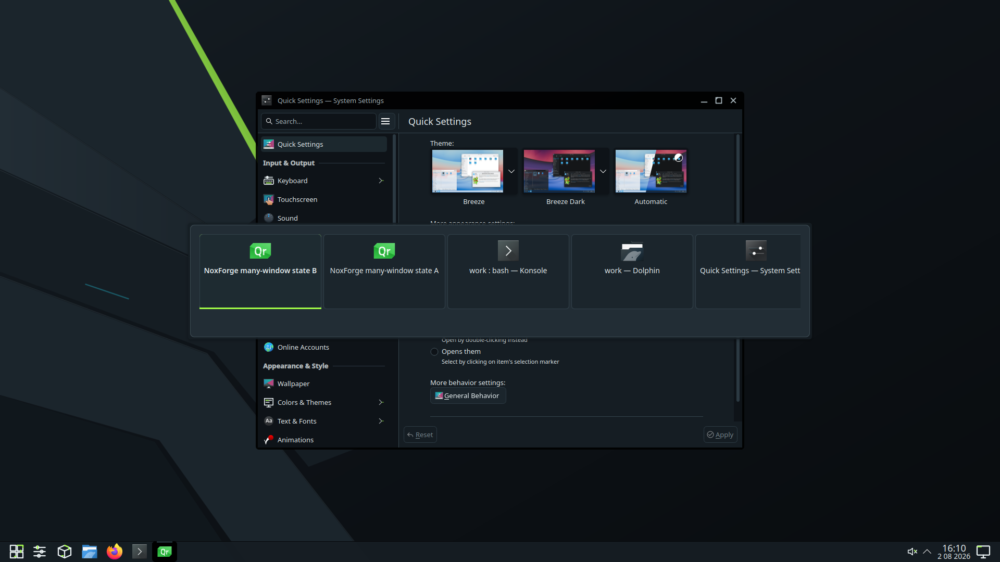
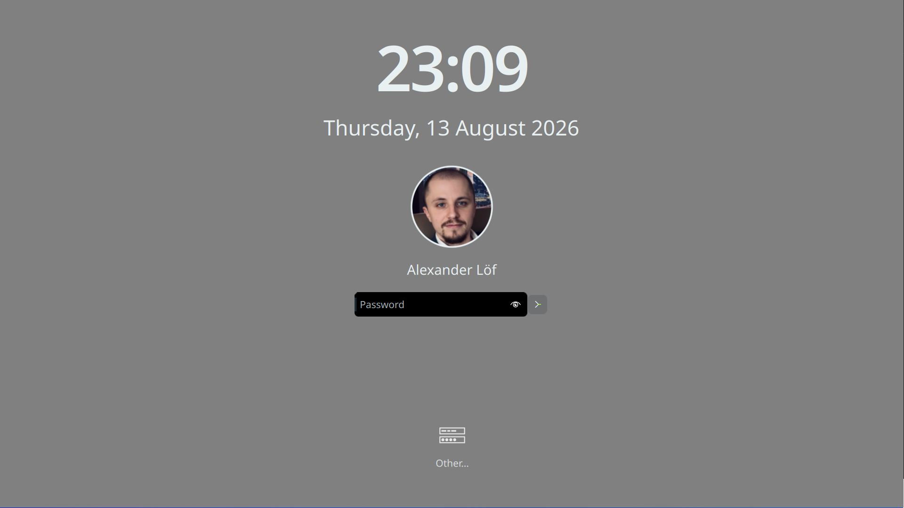
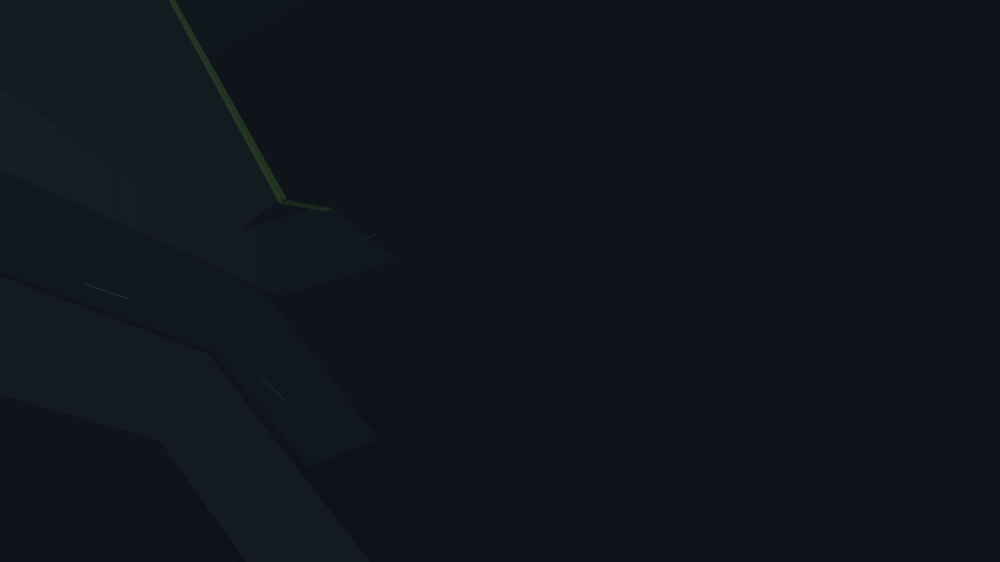

# NoxForge System Coherence

NoxForge is an original MIT-licensed Plasma visual system: quiet graphite
surfaces, exact electric-lime state markers, restrained detail, and a compact
Forge Notch. The 9.0.0 development line targets Fedora 44 and the verified
Arch Plasma/KWin 6.7+ and Qt 6.11 environment on Wayland.



The hero is retained presentation material; its provenance and the pending
fresh 2560x1440 System Coherence capture are recorded
in [media/manifest.json](media/manifest.json).

## Choose an installation

| Journey | What it includes | Boundary |
| --- | --- | --- |
| Store/component | Independently selectable KDE packages | User-local; no native Qt style, login-manager integration, or root |
| Portable | All user-local components, Breeze controls, installer, uninstaller, doctor | No login-manager integration, native plugin, or active-settings write |
| Complete system | Portable content plus native Qt style and system doctor | PLM wallpaper asset on Fedora; SDDM compatibility theme remains selectable |

Start with [Quick start](docs/QUICKSTART.md), or read the dedicated
[portable](docs/INSTALL_PORTABLE.md), [Fedora](docs/INSTALL_FEDORA.md), and
[Arch](docs/INSTALL_ARCH.md) guides. Package installation never applies a
theme, resets a panel, edits KDE configuration, or restarts Plasma.

## Gallery








Fedora 44 uses Plasma Login Manager (PLM) by default. NoxForge Quiet is the
recommended login wallpaper; NoxForge does not ship or claim a custom PLM QML
greeter and never writes the active PLM configuration. The SDDM theme remains
available for upgraded Fedora installations and the qualified Arch journey.

These images are explicitly labelled live-retained or offscreen in the media
manifest. They are not a substitute for pending physical input,
cursor, audio, PAM/login, power, and live-session gates.

## Components

- Global Theme and Plasma Style with KDE-correct package roots;
- NoxForge Dark colors, Aurorae decoration, KWin switcher, icons, cursors, and sounds;
- three selectable wallpapers: **NoxForge Forge** (`NoxForge`), **NoxForge Quiet**
  (`NoxForge-Quiet`), and **NoxForge Ultrawide** (`NoxForge-Ultrawide`);
- a native Qt 6 style, PLM wallpaper asset, and optional SDDM compatibility
  theme in the complete system edition;
- read-only edition-aware diagnostics and deterministic checksums.

Store descriptions state that components install separately and that the Global
Theme archive is not a complete one-click transaction. Store and portable
defaults use `widgetStyle=Breeze`; system packages use `widgetStyle=NoxForge`.

## Compatibility and rollback

See [compatibility](docs/COMPATIBILITY.md), [troubleshooting](docs/TROUBLESHOOTING.md),
and the [doctor manual](docs/DOCTOR_MANUAL.md). Always select a known-good
theme and login surface before rollback. Portable removal is file-precise and
RPM/Arch removal touches only package-owned paths.

## Development and evidence

The active scope is [NOXFORGE_V9_PLAN.md](docs/NOXFORGE_V9_PLAN.md), indexed by
[IMPLEMENTATION_PLAN.md](docs/IMPLEMENTATION_PLAN.md). Run the phase gate with:

```bash
python3 scripts/release-check.py --skip-rpm
python3 scripts/build.py --mode all --skip-tests
```

Full matrices remain temporary CI evidence; compact manifests and curated
representatives are tracked. See [CONTRIBUTING.md](docs/CONTRIBUTING.md) and
[MANUAL_TESTING.md](docs/MANUAL_TESTING.md) for boundaries.

## License

See [LICENSES.md](LICENSES.md). All NoxForge artwork and generated audio are
original project work.
