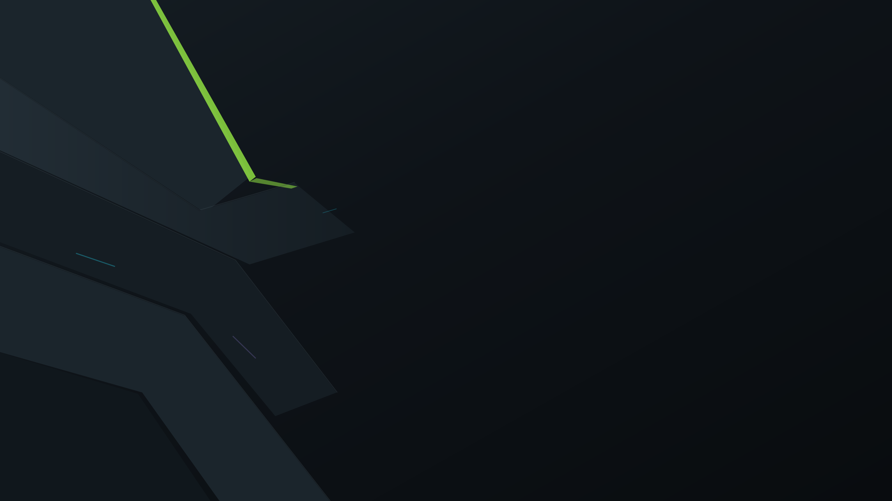

# NoxForge KDE

NoxForge is an original complete Global Theme for Fedora KDE 44, Plasma 6.7+
and Qt 6.11. Its Kinetic Precision system combines layered graphite surfaces,
precision lime focus markers, restrained cyan/violet detail and the angular
Forge Notch.

The repository provides:

- a strict Plasma 6 Look-and-Feel package and optional compact panel layout;
- NoxForge Dark colors and an expanded Plasma Style without an explicit theme fallback;
- a native Qt 6 `QStylePlugin`, Aurorae decoration and KWin task switcher;
- 185 scalable system icons, 196 physical 16/22 px variants and only `hicolor` application-logo inheritance;
- 96 physical multi-size cursors, 32 original system sounds and four wallpaper resolutions;
- original splash, logout and Qt 6 SDDM experiences;
- safe user-local and separate explicit system installation tooling.

Installation never applies the theme, changes the panel, edits SDDM settings or
restarts Plasma. See [Quick start](docs/QUICKSTART.md), the authoritative
[implementation plan](docs/IMPLEMENTATION_PLAN.md) and the live
[manual testing gate](docs/MANUAL_TESTING.md). The historical issues that drove
the rebuild are recorded in the [v2 visual baseline](docs/V2_VISUAL_BASELINE.md).
Contributors run the same local and Fedora 44 CI gate documented in
[CONTRIBUTING.md](docs/CONTRIBUTING.md).
Fedora installation, explicit selection, verification and rollback are covered
in [INSTALL_FEDORA.md](docs/INSTALL_FEDORA.md); read-only diagnostics and
recovery guidance are in [TROUBLESHOOTING.md](docs/TROUBLESHOOTING.md).

## Status

NoxForge 5.0.0 is the current stable release. The exact-tag
[GitHub release](https://github.com/loofiboss-bit/NoxForge/releases/tag/v5.0.0)
provides the verified source archive, SRPM, Fedora 44 RPM, qualification
manifest, automated report and checksums. The Fedora package is available from
COPR project `loofitheboss/noxforge`; exact publication and independent
readback evidence is recorded in
[`docs/NOXFORGE_V5_PLAN.md`](docs/NOXFORGE_V5_PLAN.md). The historical v4
GitHub release contains no attached build artifacts and made no v4 COPR or
fresh live-qualification claim.

The local release gate covers deterministic generation, Python and CTest suites,
QML lint, isolated staging, byte-identical source archives, SRPM/RPM build and
`rpmlint`. Current v5 isolated KWin/Plasma Wayland qualification covers theme
application, panel preservation and edges, 100/140 percent Qt composition and
multi-output placement. Hardware blur, injected keyboard/Alt+Tab interaction,
live RTL shell mirroring, cursor motion, isolated audio, production splash
integration and real SDDM authentication remain explicitly blocked.

## License

See [LICENSES.md](LICENSES.md). All NoxForge artwork and generated audio are
original project work.
