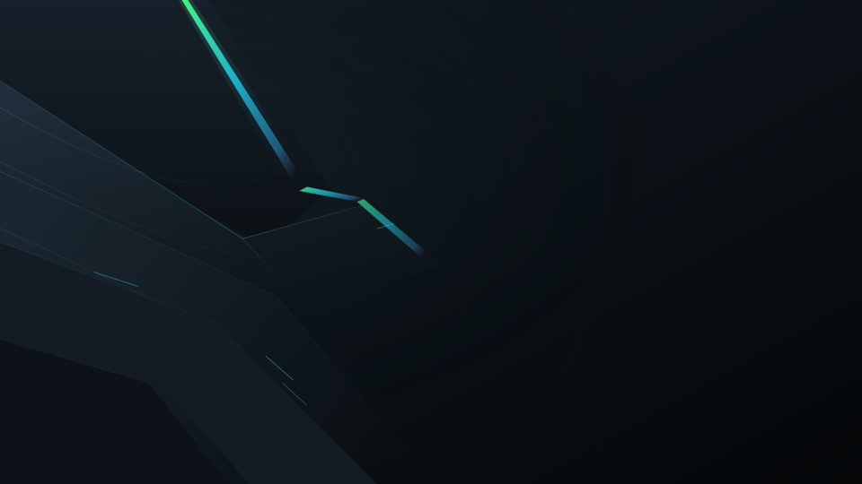
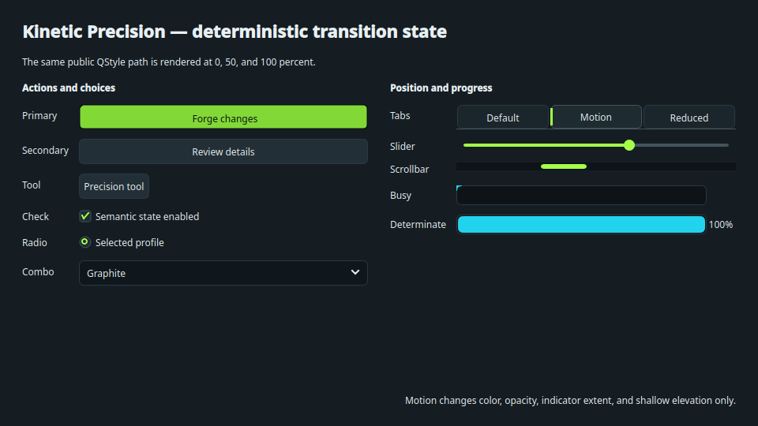
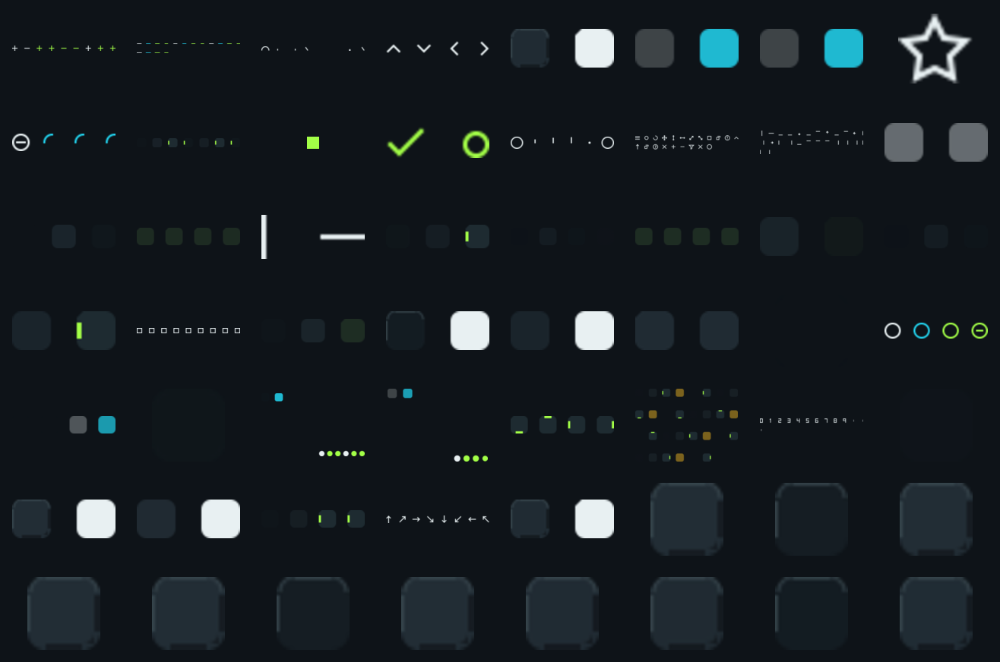
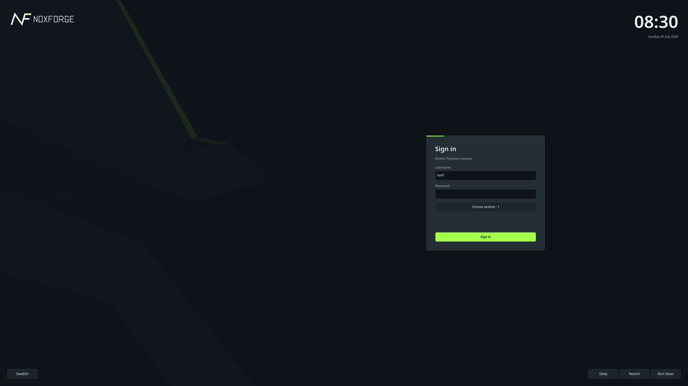
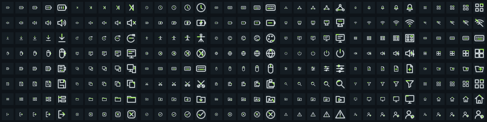

# NoxForge 7 — Operational Precision

NoxForge is an original, complete dark Global Theme for Fedora KDE 44,
Plasma/KWin 6.7+, Qt 6.11, and Wayland. Operational Precision combines quiet
graphite depth, exact lime state markers, restrained cyan/violet detail, and
short motion that settles cleanly.

*Authentic generated Global Theme preview from the exact v7 wallpaper package;
this is not live desktop or compositor evidence. Its canonical 16:9 source
output is the [2560×1440 Kinetic Precision wallpaper](wallpapers/NoxForge/contents/images/2560x1440.png).*

### Applications

### Plasma shell

### Sessions

### Details

These focused images are deterministic source-bound or authentic offscreen
outputs. They are not relabeled as a live Plasma, KWin, or SDDM session.

The repository provides:

- a strict Plasma 6 Look-and-Feel package and optional compact panel layout;
- NoxForge Dark colors and an expanded Plasma Style without an explicit theme fallback;
- a native Qt 6 `QStylePlugin`, Aurorae decoration and KWin task switcher;
- 185 scalable system icons, 196 physical 16/22 px variants and only `hicolor` application-logo inheritance;
- 96 physical multi-size cursors, 32 original system sounds and four wallpaper resolutions;
- original splash, logout and Qt 6 SDDM experiences;
- safe user-local and separate explicit system installation tooling.

Installation never applies the theme, changes the panel, edits SDDM settings or
restarts Plasma. Motion follows KDE's configured animation duration; setting it
to zero produces immediate semantic states with no spatial motion. See
[Quick start](docs/QUICKSTART.md), the authoritative
[implementation plan](docs/IMPLEMENTATION_PLAN.md) and the live
[manual testing gate](docs/MANUAL_TESTING.md). The historical issues that drove
the rebuild are recorded in the [v2 visual baseline](docs/V2_VISUAL_BASELINE.md).
Contributors run the same local and Fedora 44 CI gate documented in
[CONTRIBUTING.md](docs/CONTRIBUTING.md).
Fedora installation, explicit selection, verification and rollback are covered
in [INSTALL_FEDORA.md](docs/INSTALL_FEDORA.md); read-only diagnostics and
recovery guidance are in [TROUBLESHOOTING.md](docs/TROUBLESHOOTING.md).

## Status

NoxForge 7.0.0 is the qualified Operational Precision release represented by
`VERSION`. Its exact-tag workflow produces the source archive, SRPM, Fedora 44
RPM, qualification manifest, automated report, and checksums. Public GitHub
and COPR readback is recorded after publication in
`docs/evidence/v7/public-readback.json`; until that file exists, publication is
not claimed by the checkout.

The input-capable isolated KWin/Wayland matrix passes six single-output scales,
two mixed-output pairs, true maximization, output transitions, all panel edges,
real applications, Qt dialogs, core icons, launcher, calendar, notifications,
OSD, production Splash, SDDM test mode, Logout, and a held TabBox cycle. A
disposable Fedora 44 package matrix passes public v6 installation, v6-to-v7
upgrade, repeated install, rollback, uninstall, fresh v7 install, `rpm -V`,
`noxforge-doctor`, and KDE/SDDM configuration preservation.

The v7 gate derives its counts from actual output: 152 active Python tests,
nine historical v6 skips, 46 CTest cases, four sanitizer probes, QML lint,
deterministic generation, byte-identical archives, SRPM/RPM build, and clean
`rpmlint`. Hardware blur, audible routing, physical cursor scaling, PAM
authentication, and real power actions remain explicitly unclaimed.

Compatibility, COPR installation, explicit component selection, verification,
upgrade, and safe rollback are documented in
[INSTALL_FEDORA.md](docs/INSTALL_FEDORA.md). Always select a known-good theme
and SDDM configuration before removing a theme you applied manually.

## License

See [LICENSES.md](LICENSES.md). All NoxForge artwork and generated audio are
original project work.
