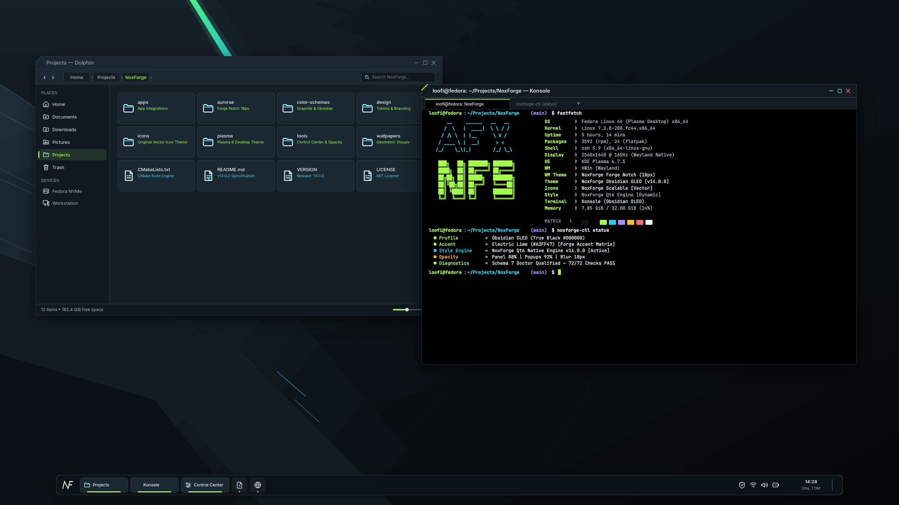
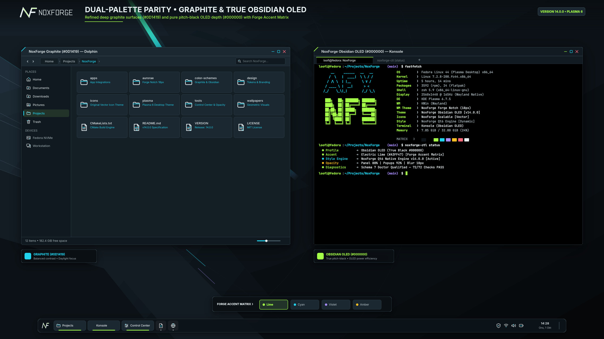
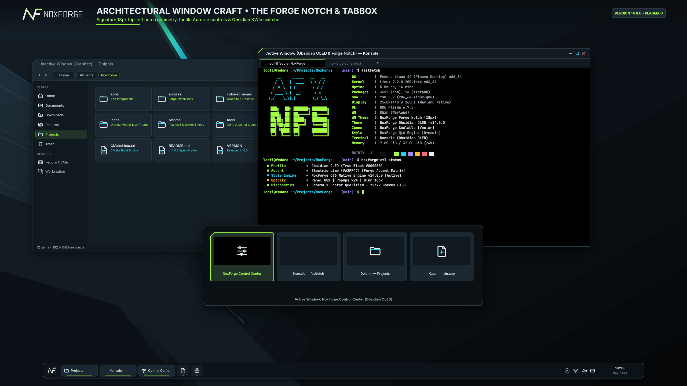
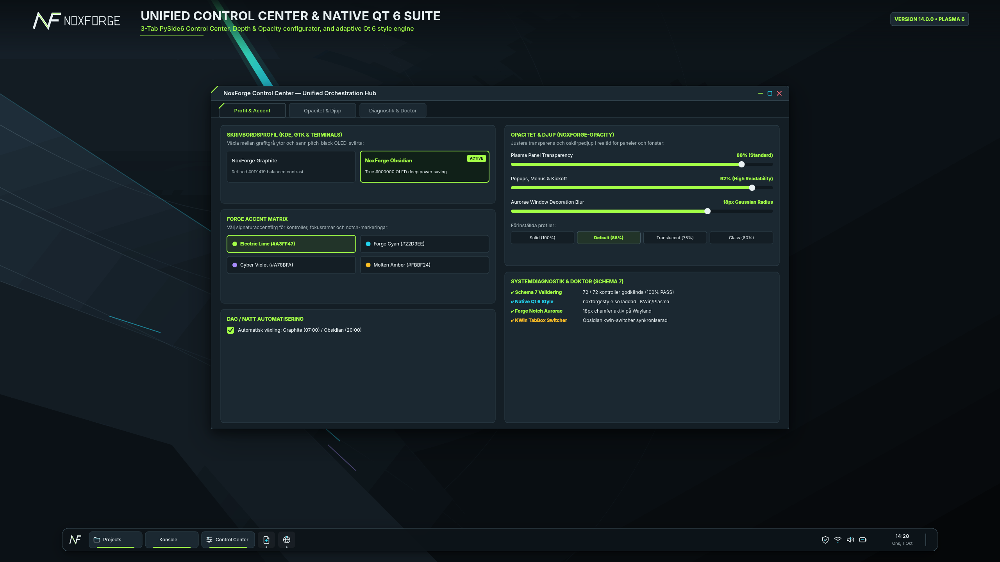
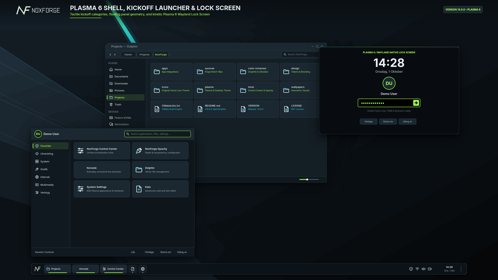
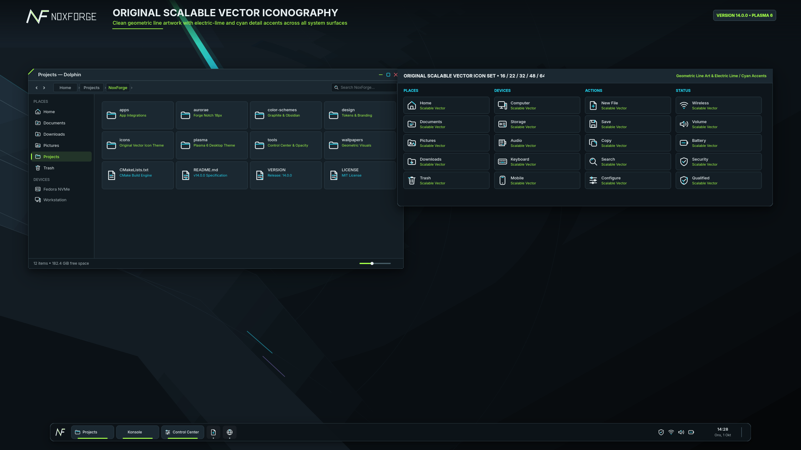
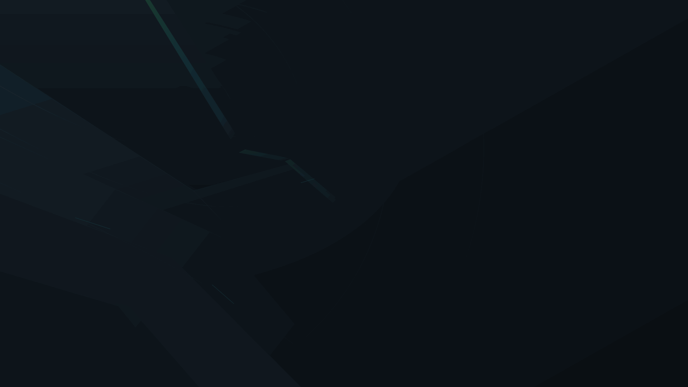

# NoxForge Kinetic Signal & Adaptive Motion Suite

NoxForge is an original MIT-licensed Plasma visual system: quiet graphite
surfaces, true-black OLED variants, an adaptive accent engine, restrained
detail, and a compact Forge Notch. Version 15.0.0 targets Fedora 44 and Arch
Plasma/KWin 6.7+ with Qt 6.11 on Wayland. It elevates the visual system with
native FreeDesktop/KDE `<style id="current-color-scheme">` vector iconography,
a multi-stage geometric Wi-Fi and signal suite (0%–100%, acquiring, locked, hotspot, disconnected),
dual-ring orbital radar busy widgets, 220ms damped horizontal error-shake motion in Lock Screen
and SDDM, an interactive Live Icon & Motion Preview canvas in the Control Center GUI,
dedicated application icons, and Doctor Schema 8 diagnostics.
See the [v15 release plan](docs/NOXFORGE_V15_PLAN.md); physical and
Arch runtime checks remain pending.



Capture provenance and dimensions are recorded
in [media/manifest.json](media/manifest.json).

## Choose an installation

| Journey | What it includes | Boundary |
| --- | --- | --- |
| Store/component | Independently selectable KDE packages, including Graphite and Obsidian variants | User-local; no native Qt style, login-manager integration, or root |
| Portable | All user-local components, Breeze controls, installer, uninstaller, doctor | No login-manager integration, native plugin, or active-settings write |
| Complete system | Portable content plus adaptive native Qt style and system doctor | PLM wallpaper asset on Fedora; Graphite and Obsidian SDDM themes remain selectable |

Start with [Quick start](docs/QUICKSTART.md), or read the dedicated
[portable](docs/INSTALL_PORTABLE.md), [Fedora](docs/INSTALL_FEDORA.md), and
[Arch](docs/INSTALL_ARCH.md) guides. Package installation never applies a
theme, resets a panel, edits KDE configuration, or restarts Plasma.

## Gallery









Fedora 44 uses Plasma Login Manager (PLM) by default. NoxForge Quiet is the
recommended PLM wallpaper; NoxForge does not ship or claim a custom PLM QML
greeter and never writes the active PLM configuration. Graphite and Obsidian
SDDM themes are optional compatibility components and are never selected
automatically.

Both SDDM themes and both Plasma lock screens can expose the experimental
LoofiFaceID factor when the matching version-pinned SDDM or KScreenLocker API
is installed. NoxForge does not install or enable biometric authentication;
ordinary SDDM and KScreenLocker continue to use their password paths. See the
[experimental face-authentication integration](docs/EXPERIMENTAL_FACE_AUTH.md).

These images carry explicit capture provenance in the media manifest. They are not a substitute for pending physical input,
cursor, audio, PAM/login, power, and live-session gates.

## Components

- Graphite and Obsidian Global Themes, Plasma Styles, and Aurorae decorations
  with KDE-correct package roots;
- NoxForge Dark and Obsidian colors, matching Konsole themes, Aurorae decoration,
  KWin switchers (Graphite and Obsidian), icons, cursors, and sounds;
- native Plasma 6 / Wayland Lock Screen with kinetic password focus for both
  Graphite and Obsidian look-and-feel packages;
- GTK 3 and GTK 4 themes, Kate/KWrite syntax themes, and VS Code/Cursor editor
  themes in standard and Obsidian palettes;
- Zed editor themes, btop monitors, Starship prompt, Fastfetch preset, Discord / Vesktop
  CSS, and Firefox browser theming (userChrome.css and extension manifest);
- Ghostty, Alacritty, Kitty, and Foot configurations for both terminal palettes;
- five selectable wallpapers: **NoxForge Forge** (`NoxForge`), **NoxForge
  Quiet** (`NoxForge-Quiet`), **NoxForge Ultrawide** (`NoxForge-Ultrawide`),
  **NoxForge Obsidian** (`NoxForge-Obsidian`), and **NoxForge Obsidian
  Ultrawide** (`NoxForge-Obsidian-Ultrawide`);
- a native Qt 6 style that dynamically adapts to the active NoxForge palette and
  Forge Accent Matrix (Lime, Cyan, Violet, Amber) via `NOXFORGE_ACCENT` and `kdeglobals`;
- dynamic QMenu and menubar layout preventing text truncation across fractional display scales;
- unified orchestration suite: `noxforge-ctl` CLI and 3-tab PySide6 Control Center GUI
  (`io.github.loofiboss.noxforge.controlcenter.desktop`);
- `noxforge-opacity` CLI utility and Qt 6 GUI configurator for adjusting panel,
  popup, and Aurorae window decoration transparency levels;
- read-only edition-aware diagnostics, automated `--apply-sync` alignment (Schema 8),
  and deterministic checksums.

Store descriptions state that components install separately and that the Global
Theme archive is not a complete one-click transaction. Store and portable
defaults use `widgetStyle=Breeze`; system packages use `widgetStyle=NoxForge`.

## Compatibility and rollback

See [compatibility](docs/COMPATIBILITY.md), [troubleshooting](docs/TROUBLESHOOTING.md),
the [control center manual](docs/CONTROL_CENTER_MANUAL.md), the [opacity manual](docs/OPACITY_MANUAL.md),
and the [doctor manual](docs/DOCTOR_MANUAL.md). Always select a known-good
theme and login surface before rollback. Portable removal is file-precise and
RPM/Arch removal touches only package-owned paths.

## Development and evidence

The v15 release scope is recorded in
[NOXFORGE_V15_PLAN.md](docs/NOXFORGE_V15_PLAN.md), indexed by
[IMPLEMENTATION_PLAN.md](docs/IMPLEMENTATION_PLAN.md). Run the release gate with:

```bash
mkdir -p build/baseline-source
baseline_commit=$(python3 -c 'import json; from pathlib import Path; print(json.loads(Path("distribution/release-manifest.json").read_text())["release"]["baseline"]["commit"])')
git archive "$baseline_commit" | tar -x -C build/baseline-source
python3 scripts/release-check.py --baseline-source build/baseline-source
```

Full matrices remain temporary CI evidence; compact manifests and curated
representatives are tracked. See [CONTRIBUTING.md](docs/CONTRIBUTING.md) and
[MANUAL_TESTING.md](docs/MANUAL_TESTING.md) for boundaries.

## License

See [LICENSES.md](LICENSES.md). All NoxForge artwork and generated audio are
original project work.
